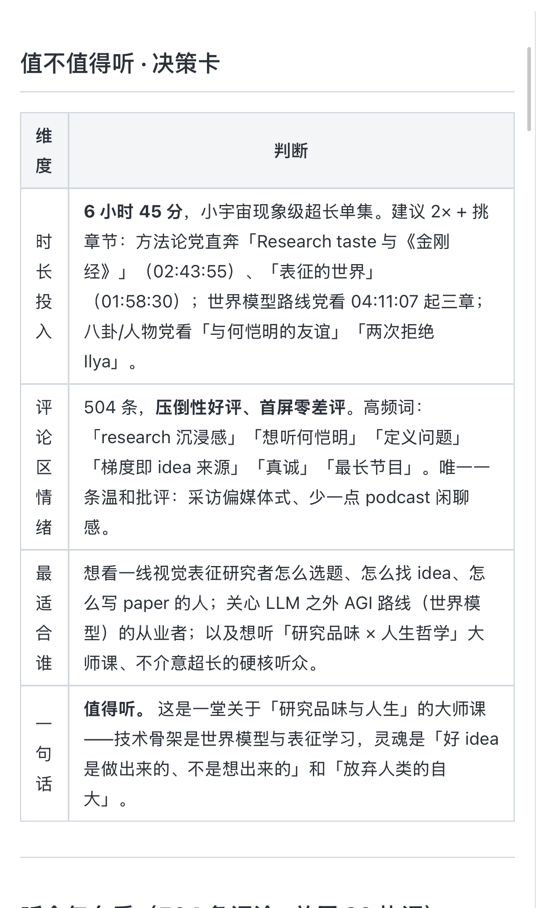
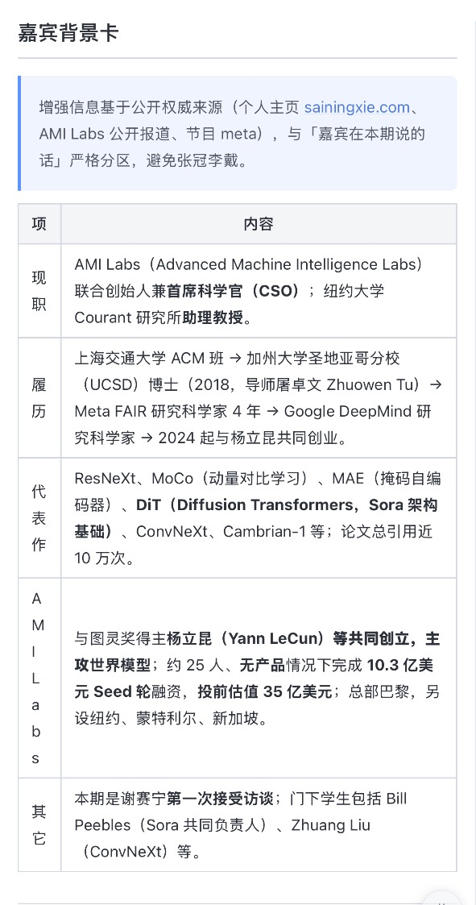
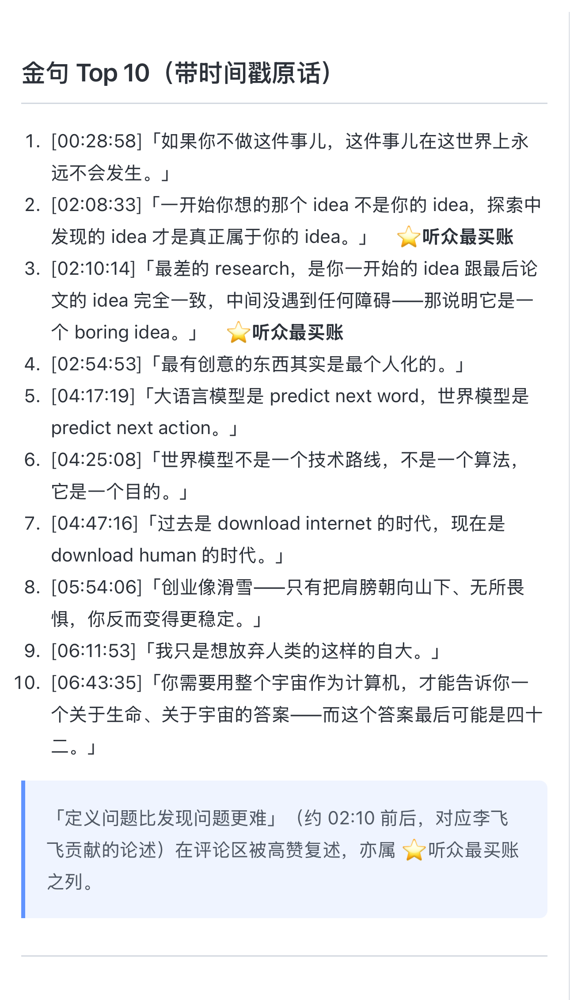

# 🥤 小宇宙榨汁机 · xiaoyuzhou-juicer


-success.svg)


> 一条小宇宙链接，把一期播客**榨干**成可读逐字稿 + 官方章节 + 嘉宾背景 + 结构化摘要。

把一条小宇宙（小宇宙 FM）单集链接，变成**可读逐字稿 + 官方章节 + 嘉宾背景增强 + 结构化摘要**的本地笔记工具。

> A bring-your-own-token tool to fetch & structure transcripts of your own
> Xiaoyuzhou podcast episodes for personal, offline study. Ships code only —
> never bundles credentials or any podcast content.

> **纯标准库，无需 `pip install`** —— 只要 Python 3.8+ 就能跑。

---

## ⚠️ 免责声明（先读）

- 本工具通过小宇宙的私有接口抓取数据，**仅供个人对自己账号有权访问的内容做本地存档 / 学习 / 无障碍用途**。
- **不内置任何账号凭证**，需用户自带自己的登录 token（BYO-token）。
- **不分发任何音频或逐字稿内容**，只提供抓取代码；产出文件请勿公开转载。
- **不提供规模化爬取能力**，请勿高频批量请求，尊重平台 ToS 与内容版权。
- 接口为逆向所得，平台改版可能导致失效，**风险自负**。

---

## 能做什么

| 能力 | 需要 token？ |
|------|:---:|
| 节目元信息（标题 / 时长 / 发布日 / 音频直链） | ❌ |
| 官方章节目录（shownotes 里带时间戳的章节） | ❌ |
| 评论区首屏热评（约 20 条，按热度，SSR） | ❌ |
| 逐字稿（可读 markdown + 原始 JSON） | ✅ |
| 发现页聚合（最热/锋芒/新星榜 + 编辑精选 + 为你推荐） | ✅ |
| 订阅清单 + 订阅最新更新（inbox） | ✅ |
| 说话人标注（LLM 语义推断，主持人 / 嘉宾） | 由 AI 完成 |
| 嘉宾背景增强（WebFetch 抓权威页面补履历） | 由 AI 完成 |
| 结构化摘要（以官方章节为骨架） / 评论区观点总结 | 由 AI 完成 |

> 抓取类由 `scripts/xyz_fetch.py` 完成；标注/增强/摘要/评论总结是 Claude Code skill 流程，依赖 `SKILL.md`。
> 注：小宇宙刻意不提供全站长榜，每个榜单 API 仅暴露 Top 3。

## 产出长这样

> 以下为**格式示意**（占位内容，非任何真实节目逐字稿）。

可读逐字稿 `transcript.md`：

```markdown
**[00:01:30]**
（这里是这一段约 90 秒的逐字稿正文……）

**[00:03:00]**
（下一段……）
```

评论区热评 `comments.md`（带身份信号 `[主播]`/`[嘉宾]`/`⭐资深`）：

```markdown
- 👍128　**听众A**（北京）　2026-01-01
  这期嘉宾讲得真好。
  - 👍12　**听众B**⭐资深（上海）　2026-01-01
    同感，已二刷。
```

结构化摘要 `摘要.md` 的「值不值得听 · 决策卡」：

| 维度 | 判断 |
|------|------|
| 时长投入 | XhYYmin，建议 2× / 挑章节 |
| 评论区情绪 | 好评为主，高频词「……」 |
| 最适合谁 | 一句话目标听众 |
| 一句话 | **值得/可跳过** + 听的核心 |

## 📸 真实样例

用一期真实超长播客（6h45min）跑出来的产出截图——决策卡、嘉宾背景卡、章节骨架、金句、争议存疑：

<p align="center">
  
  
  
</p>

> 👉 完整 6 张样例与说明见 **[docs/demo/](docs/demo/)**。截图仅演示输出结构，来源张小珺·商业访谈录 #133，版权归原播客所有，请勿转载完整产出。

## 快速开始

### 1. 只取元信息 / 官方章节（无需 token）

```bash
python3 scripts/xyz_fetch.py "https://www.xiaoyuzhoufm.com/episode/<EID>" \
  --meta-only
```

### 2. 连同逐字稿一起取（需 token）

```bash
# 先把你的 token 写进 config/token.txt（见下）
python3 scripts/xyz_fetch.py "https://www.xiaoyuzhoufm.com/episode/<EID>" \
  --token-file config/token.txt
```

抓取缓存默认写到 `~/.cache/xiaoyuzhou-juicer/<EID>/`（遵循 XDG，`--out` 可覆盖；
不污染 skill 安装目录。这些是按 EID 可重建的缓存，成品另行归档）：

```
meta.json        元信息 + 音频直链 + mediaId
chapters.md      官方章节（带时间戳）
shownotes.md     完整 shownotes 纯文本
transcript.json  逐字稿原始数组 [{text, startMs}]
transcript.md    可读逐字稿（每 ~90s 一个时间戳锚点）
```

### 3. 评论区首屏热评（无需 token）

```bash
python3 scripts/xyz_fetch.py "https://www.xiaoyuzhoufm.com/episode/<EID>" \
  --meta-only --comments        # → <EID>/comments.{json,md}
```

### 4. 发现 / 订阅 / 订阅更新（需 token，不依赖某条单集）

```bash
python3 scripts/xyz_fetch.py --discover      --token-file config/token.txt  # → discover.md
python3 scripts/xyz_fetch.py --subscriptions --token-file config/token.txt  # → subscriptions.md
python3 scripts/xyz_fetch.py --inbox         --token-file config/token.txt  # → inbox.md
```

## 如何拿到 token

小宇宙的 `x-jike-access-token` **只活约 2 小时**，但配套的 `x-jike-refresh-token`
**长效**。本工具存 **refresh token**，每次运行自动续期出新的 access token，并把轮换后的
refresh token 回存——**你只需配置一次**。

1. 电脑浏览器登录 https://www.xiaoyuzhoufm.com （用 App 扫码）。
2. F12 打开开发者工具 → **Network** 面板 → 刷新页面。
3. 点任意一个 `web-api.xiaoyuzhoufm.com` 的 **200** 请求。
4. 展开 **Request Headers**，找到 **`x-jike-refresh-token: xxxxx`**，复制冒号后那串值。
   （同处也有 `x-jike-access-token`，但那枚短效，配 refresh token 更省事。）
5. 存入 `config/token.txt`（单独一行），或设环境变量：

```bash
export XYZ_REFRESH_TOKEN="你的refresh_token"
```

> - refresh token 会**轮换**：每次续期后旧的作废、新的自动写回 `config/token.txt`。
> - 续期接口返回非 200，说明 refresh token 也失效了（长时间未用），重新登录抓一次即可。
> - 只有短效 access token 时：`--token-file config/token.txt --token-is-access`。
> - `config/token.txt` 已被 `.gitignore` 忽略，不会进仓库。

## 作为 Claude Code Skill 使用

把整个目录放进 `~/.claude/skills/`，对话里给出小宇宙链接即可触发，
Claude 会按 `SKILL.md` 跑：抓取 → 读章节 → 说话人标注 → WebFetch 增强嘉宾背景 → 用官方章节做骨架出摘要。

## 架构

```
小宇宙链接 / eid
  ├─[脚本] 元信息 + 官方章节 + 音频链      （免 token，SSR 解析）
  ├─[脚本] 逐字稿 text+startMs            （BYO-token + App UA）
  ├─[AI]   说话人标注（语义推断）
  ├─[AI]   嘉宾背景增强（WebFetch + 引用来源）
  └─[AI]   结构化摘要（官方章节为骨架）
```

## 已知限制

- 逐字稿来自小宇宙自动 ASR，**无说话人标注**、英文/人名/术语可能转错。
- 逐字稿 CDN 有 **User-Agent 白名单**，脚本已内置可用 App UA；平台改版可能需更新 `UA_APP`。
- 纯标准库实现，无第三方依赖，Python 3.8+。

## 开发与贡献

- 贡献流程见 [CONTRIBUTING.md](CONTRIBUTING.md)；版本变更见 [CHANGELOG.md](CHANGELOG.md)。
- 凭证处理与安全策略见 [SECURITY.md](SECURITY.md)。
- 本地自检：`ruff check scripts/` + `python3 -m compileall -q scripts`（CI 同款，配置见 `pyproject.toml`）。

## License

MIT，见 [LICENSE](LICENSE)。
