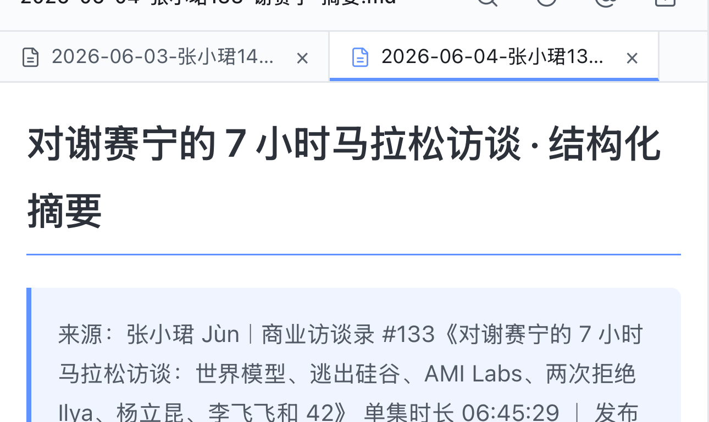
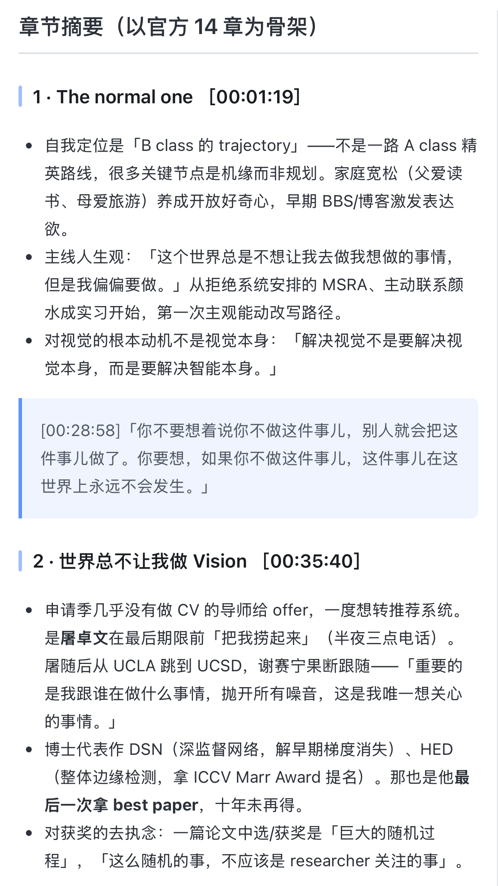
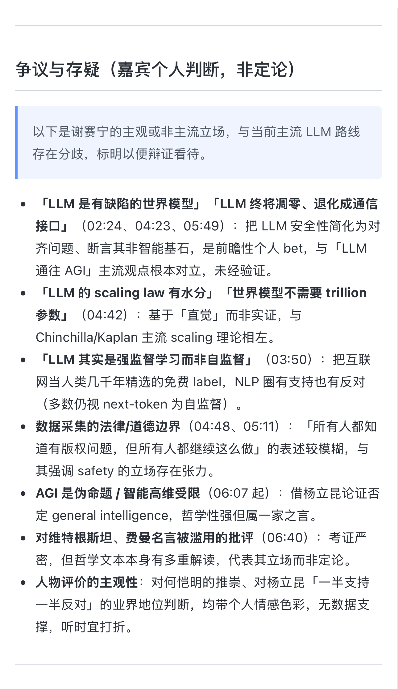

# 📸 真实样例 · Demo

下面是用本工具处理**一期真实超长播客**后的产出截图，用来直观展示「榨」出来的结构长什么样。

> ⚠️ **样例说明**
> - 截图仅用于**演示输出结构**，非完整产出；完整逐字稿 / 摘要请勿公开转载（详见 [SECURITY.md](../../SECURITY.md)）。
> - 来源：张小珺 · 商业访谈录 #133《对谢赛宁的 7 小时马拉松访谈》（单集时长 06:45:29）。版权归原播客所有，此处为引用演示。
> - 评论区涉及第三方听众的截图已剔除，仅保留聚合判断。

## 一、概览：标题 + 来源溯源

每份摘要顶部都带**可核验的来源框**（节目名 / 期号 / 时长 / 单集链接 / 整理日期 / ASR 订正说明）。

## 二、值不值得听 · 决策卡

先给**该不该花时间听**的判断：时长投入、评论区情绪、最适合谁、一句话结论。

## 三、嘉宾背景卡（WebFetch 联网增强）

基于公开权威来源补全嘉宾履历，并与「嘉宾在本期说的话」严格分区，避免张冠李戴。

## 四、章节摘要（以官方 14 章为骨架）

按节目官方章节拆分，每章给核心观点 + 带时间戳的原话引用。

## 五、金句 Top 10（带时间戳）

可定位回放的高密度金句，并回标评论区**听众最买账**的几条。

## 六、争议与存疑（区分立场 vs 定论）

把嘉宾的**主观 / 非主流立场**单独标出，与已验证事实分开，便于辩证看待。

